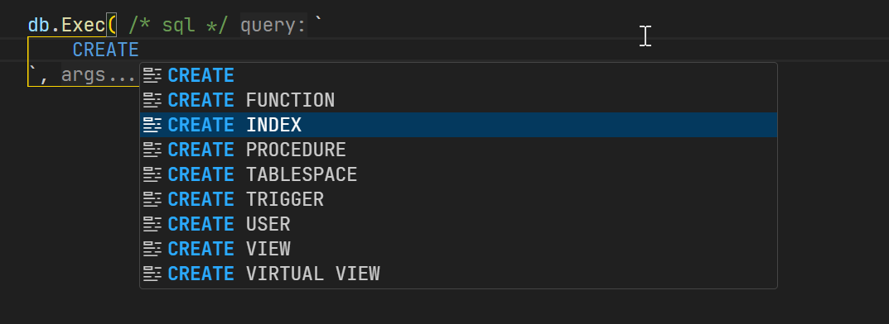
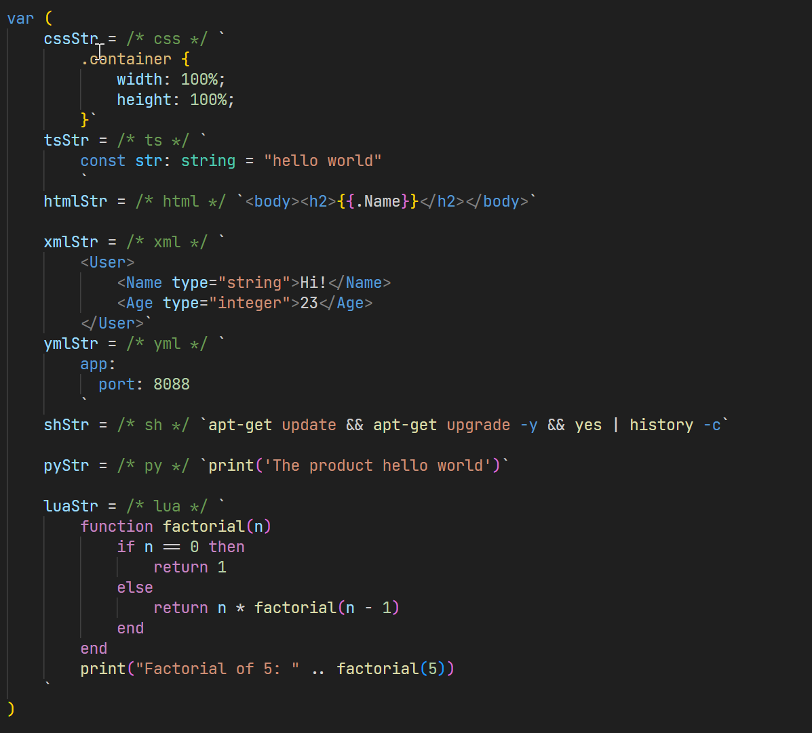
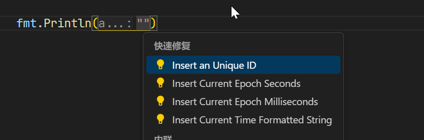
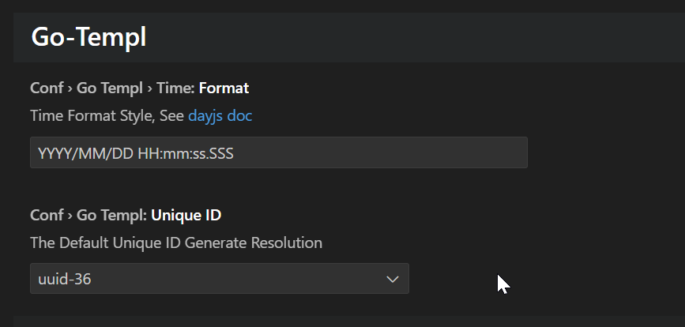

# go-templ-syntaxhighlight README

## Features

1. **html, js/ts, lua, shell, sql, yaml, xml, python, css** grammar highlight in golang raw string with `/* [lang] */` comment prefix;
2. Test data quick insert by `Ctrl+.` for golang file, support insert timestamp, unique id, current time formatted-string(use dayjs)
3. Support inline basic keyword completion in `/* sql */` commented raw string(it not yet finish)

> Tip: you can change unique id generate method and change time format style in setting.

## Screenshots

- Basic inline SQL keyword completion
  
- EmbedLanguage Highlight
  
- Quick test data insert
  
  
